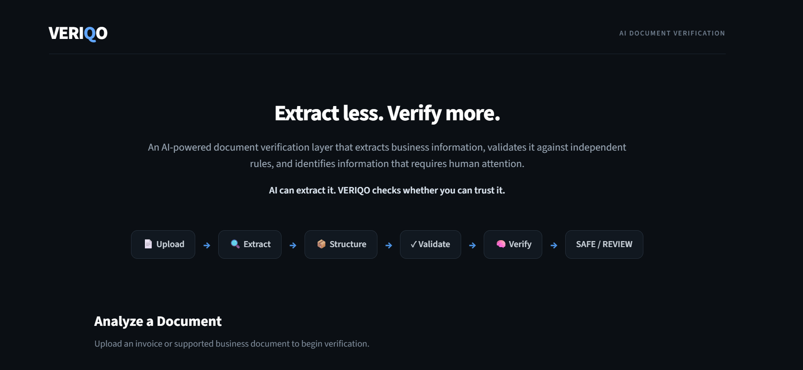

# VERIQO

### Extract less. Verify more.

**VERIQO** is an AI-powered document verification system that goes beyond simple information extraction.

It extracts structured information from real-world business documents, validates the extracted values against independent business rules, combines reliability signals, and identifies information that requires human attention.

> **AI can extract it. VERIQO checks whether you can trust it.**

<p align="center">
  
</p>

<p align="center">
  <em>VERIQO — AI-powered document verification dashboard</em>
</p>

---

## 🚀 The Problem

Traditional document AI focuses mainly on:

**Document → Extracted Data**

But extraction alone does not guarantee that the extracted information is correct.

Real-world documents can contain:

- Poor-quality scans
- OCR errors
- Incorrect calculations
- Missing information
- Inconsistent values
- Ambiguous fields

If incorrect information enters a downstream business workflow, the problem is no longer just an extraction error — it becomes a **data trust problem**.

---

## 💡 Our Solution

VERIQO adds a **verification layer after extraction**.

Instead of blindly accepting extracted information, VERIQO follows:

```text
Upload
   ↓
Extract
   ↓
Structure
   ↓
Validate
   ↓
Verify
   ↓
SAFE / REVIEW